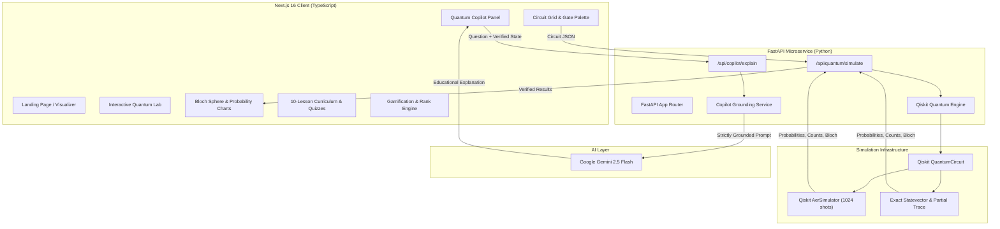

# QubitLabs

> **"Don't just learn quantum computing. See it happen."**

[](https://nextjs.org/)
[](https://fastapi.tiangolo.com/)
[](https://qiskit.org/)
[](https://ai.google.dev/)
[](https://www.typescriptlang.org/)
[](scripts/test-validation.ts)
[](LICENSE)

QubitLabs is an AI-powered interactive quantum computing learning platform where students, researchers, and engineers build real quantum circuits, execute them on IBM Qiskit Aer, visualize complex statevectors and 3D Bloch spheres, receive context-aware explanations from an AI Copilot, and demonstrate mastery through deterministic quizzes and coding challenges.

---

## 1. Live Demo

- **Production URL**: [https://qubitlabs-ai.vercel.app/](https://qubitlabs-ai.vercel.app/)
- **Alternative Alias**: [https://qubitlabs-quantum.vercel.app/](https://qubitlabs-quantum.vercel.app/)
- **API Backend**: [https://qubitlabs-api.vercel.app/](https://qubitlabs-api.vercel.app/)
- **GitHub Repository**: [https://github.com/DevSolanki-works/QubitLabs](https://github.com/DevSolanki-works/QubitLabs)

---

## 2. Why QubitLabs?

Quantum mechanics is mathematically rigorous, abstract, and counterintuitive. Traditional quantum education presents two major barriers:
1. **The Theory-to-Practice Gap**: Students memorize linear algebra ($|\psi\rangle = \alpha|0\rangle + \beta|1\rangle$) without developing geometric or physical intuition for state transformations.
2. **The Black-Box Feedback Problem**: Students run circuits on simulators or cloud hardware, observe statistical measurement distributions, but lack a tutor to explain **why** phase interference or entanglement yielded those specific numbers.

QubitLabs closes the loop through a continuous learning cycle:

$$\text{LEARN} \longrightarrow \text{BUILD} \longrightarrow \text{SIMULATE} \longrightarrow \text{VISUALIZE} \longrightarrow \text{ASK} \longrightarrow \text{PRACTICE} \longrightarrow \text{PROVE}$$

Learners observe theoretical concepts in action, inspect the resulting quantum states, and receive real-time, grounded AI guidance based on verified simulation physics.

---

## 3. Core Features

### 🔬 Interactive Quantum Lab
- **Multi-Qubit Circuit Composer**: Drag-and-drop circuit canvas supporting $H$, $X$, $Y$, $Z$, $S$, $T$, $CX$ (CNOT), and $M$ (measurement) operations across up to 4 qubits.
- **Qiskit Aer Execution**: Real backend execution compiling user circuits into Qiskit `QuantumCircuit` objects and simulating 1,024 shots on `AerSimulator`.
- **Complete Quantum State Visualizations**:
  - **Continuous Statevector**: Complex amplitudes ($\alpha, \beta$), real/imaginary parts, and phase.
  - **Measurement Probabilities**: Analytical Dirac state probabilities ($P(x) = |\langle x|\psi\rangle|^2$).
  - **Shot Distribution Counts**: Empirical bar charts of simulated detector collapses.
  - **3D Interactive Bloch Sphere**: Computes reduced density matrices via partial trace ($\rho_i = \text{Tr}_{j \neq i}(\rho)$) and projects individual qubit Bloch vectors $(\langle X \rangle, \langle Y \rangle, \langle Z \rangle)$ in 3D.
  - **OpenQASM Export**: Real-time compilation into standard OpenQASM 2.0 code.

### 🧠 Grounded Quantum Copilot
- **Grounded AI Tutoring**: Powered by Google Gemini (`gemini-2.5-flash`), strictly grounded in the verified Qiskit simulation results.
- **Three Pedagogical Modes**:
  - **Explain**: Deconstructs why the circuit produced specific probabilities and state amplitudes.
  - **Debug**: Identifies circuit errors, missing gates, or order mistakes without inventing symptoms.
  - **Explore**: Proposes targeted physical experiments to deepen intuition.
- **Context-Aware Memory**: Receives active circuit topology, current simulation vectors, and active challenge objectives.

### 📚 Structured 10-Lesson Curriculum
Curated curriculum spanning 4 difficulty tiers:
1. **Level 1 — Foundations**: Qubit Basics, Measurement & Collapse, Superposition, The Bloch Sphere.
2. **Level 2 — Gates & Entanglement**: Unitary Operations & Phase, Quantum Entanglement & Bell States.
3. **Level 3 — Algorithms & Protocols**: Deutsch-Jozsa Algorithm, Quantum Teleportation, Grover's Search Algorithm.
4. **Level 4 — Frontier & NISQ**: Variational Quantum Eigensolver (VQE) & Noisy Intermediate-Scale Quantum computing.

### 🎯 Deterministic Challenges & Quizzes
- **Hands-on Circuit Challenges**: Challenges like Superposition, Bell State synthesis, and Grover Search evaluated deterministically against live simulation outputs.
- **Conceptual Quizzes**: In-lesson knowledge checks with detailed physical rationales explaining why choices are correct or incorrect.

### 🏆 Gamification & Consistency Tracking
- **8 Technical Ranks**: Progression from *Qubit Novice* (0 XP) up to *Quantum Master* (2,600+ XP).
- **12 Verifiable Achievements**: Milestones celebrating physical discoveries (*First Qubit*, *State Collapse*, *Spooky Correlation*, *Theory Ace*, *Algorithm Architect*).
- **Daily Streak Counter**: Timezone-safe local activity tracking to encourage consistent study.

---

## 4. How It Works

```
Student in Lab / Lesson
        │
        ▼
   Build Circuit (H, X, CNOT, ...)
        │
        ▼
   POST /api/quantum/simulate
        │
        ▼
FastAPI + Qiskit Engine
   ├── Builds QuantumCircuit
   ├── Calculates Statevector
   ├── Simulates 1024 Shots on AerSimulator
   └── Computes Bloch Coordinates (Tr_j(ρ))
        │
        ▼
Verified Simulation Results
   ├── Statevector & Probabilities
   ├── Measurement Counts
   └── 3D Bloch Spheres
        │
        ▼
Student Asks Quantum Copilot
        │
        ▼
POST /api/copilot/explain
   ├── Enriched with Verified Quantum Facts
   └── Passed to Google Gemini 2.5
        │
        ▼
Grounded Conceptual Explanation in Chat
```

> **Important Technical Principle**: Qiskit/Aer is the sole source of truth for quantum simulation. Google Gemini acts strictly as a pedagogical explainer. Gemini never simulates circuits or fabricates measurement numbers.

---

## 5. System Architecture



---

## 6. Technology Stack

### Frontend
- **Framework**: [Next.js 16](https://nextjs.org/) (App Router, React 19)
- **Language**: [TypeScript 5](https://www.typescriptlang.org/)
- **Styling**: [Tailwind CSS 4](https://tailwindcss.com/)
- **3D Graphics**: [Three.js](https://threejs.org/), [@react-three/fiber](https://docs.pmnd.rs/react-three-fiber), [@react-three/drei](https://github.com/pmndrs/drei)
- **Animation & Transitions**: [GSAP 3](https://greensock.com/gsap/), [Framer Motion](https://www.framer.com/motion/)
- **Visualizations**: [Recharts](https://recharts.org/), Custom Canvas 3D Bloch Spheres
- **Code Editor**: [@monaco-editor/react](https://github.com/suren-atoyan/monaco-react)
- **Icons**: [Lucide React](https://lucide.dev/)

### Backend
- **Framework**: [FastAPI 0.110](https://fastapi.tiangolo.com/)
- **Language**: [Python 3.11+](https://www.python.org/)
- **Quantum Simulation**: [Qiskit 1.x](https://qiskit.org/), [Qiskit Aer](https://github.com/Qiskit/qiskit-aer)
- **Scientific Computing**: [NumPy](https://numpy.org/)
- **Data Validation**: [Pydantic v2](https://docs.pydantic.dev/)
- **AI SDK**: [google-genai](https://github.com/googleapis/python-genai)

### Deployment
- **Frontend**: Vercel (Edge-optimized static generation & client hydration)
- **Backend**: Vercel Serverless Python Runtime (`python-3.12`)

---

## 7. Project Structure

```
QubitLabs/
├── backend/
│   ├── app/
│   │   ├── api/
│   │   │   ├── copilot.py          # Copilot explanation endpoint
│   │   │   └── simulation.py       # Circuit simulation endpoint
│   │   ├── quantum/
│   │   │   ├── models/             # Pydantic schemas (requests & responses)
│   │   │   └── engine.py           # Qiskit circuit builder & Aer engine
│   │   ├── services/
│   │   │   └── copilot.py          # Grounded Gemini prompt engineering
│   │   └── main.py                 # FastAPI application and CORS setup
│   ├── requirements.txt            # Python dependencies
│   ├── vercel.json                 # Backend serverless configuration
│   └── .env.example                # Backend environment template
├── frontend/
│   ├── app/
│   │   ├── challenges/page.tsx     # Assessment and challenges hub
│   │   ├── dashboard/page.tsx      # Ranks, streaks, and achievements
│   │   ├── lab/page.tsx            # Full interactive Quantum Lab
│   │   ├── learn/
│   │   │   ├── [id]/page.tsx       # Standardized lesson & quiz layout
│   │   │   └── page.tsx            # Visual progression node map
│   │   ├── layout.tsx              # Root HTML and metadata layout
│   │   └── page.tsx                # 3D interactive hero landing page
│   ├── components/
│   │   ├── landing/                # 3D landing visualizer & shaders
│   │   ├── BlochCard.tsx           # Bloch sphere container & readout
│   │   ├── BlochSphere.tsx         # 3D Three.js Bloch sphere visualizer
│   │   ├── CircuitGrid.tsx         # Interactive drag-and-drop circuit matrix
│   │   ├── GatePalette.tsx         # Quantum gate toolbar (H, X, CNOT, etc.)
│   │   ├── LearningPathTree.tsx    # Visual curriculum tree with status nodes
│   │   ├── MeasurementChart.tsx    # Empirical 1024-shot counts bar chart
│   │   ├── ProbabilityChart.tsx    # Theoretical statevector probability distribution
│   │   ├── QuantumCopilot.tsx      # Grounded AI assistant panel
│   │   ├── QuizCard.tsx            # Deterministic conceptual quiz card
│   │   └── ResourceCard.tsx        # Curated primary-source card
│   ├── lib/
│   │   ├── challenges.ts           # Challenge definitions & criteria
│   │   ├── challengeValidator.ts   # Deterministic challenge verification
│   │   ├── circuit.ts              # Circuit serialization & validation
│   │   ├── gamification.ts         # XP math, 8 ranks, 12 achievements, streaks
│   │   ├── lessons.ts              # 10-lesson curriculum content & levels
│   │   ├── progress.ts             # Persistent progress tracking
│   │   ├── quizzes.ts              # Authored conceptual questions & rationales
│   │   └── resources.ts            # Verified institutional library
│   ├── scripts/
│   │   └── test-validation.ts      # Automated 31-test validation suite
│   ├── package.json                # Frontend scripts and dependencies
│   └── .env.example                # Frontend environment template
├── docs/
│   └── screenshots/                # Screenshot storage & documentation
├── .env.example                    # Unified root environment template
├── .gitignore                      # Security-verified git ignore rules
├── CONTRIBUTING.md                 # Contribution and PR guidelines
└── README.md                       # Comprehensive platform documentation
```

---

## 8. Local Development Setup

### Prerequisites
- **Node.js**: v18.17+ or v20+
- **Python**: v3.11 or v3.12
- **Git**

### 1. Clone the Repository
```bash
git clone https://github.com/DevSolanki-works/QubitLabs.git
cd QubitLabs
```

### 2. Backend Setup
```bash
cd backend

# Create and activate a Python virtual environment
python -m venv .venv

# Windows:
.venv\Scripts\activate
# macOS/Linux:
source .venv/bin/activate

# Install dependencies
pip install -r requirements.txt

# Configure environment
cp .env.example .env
# Edit .env and add your GEMINI_API_KEY

# Launch the FastAPI server
uvicorn app.main:app --reload --port 8000
```
The backend API is now running at `http://localhost:8000`. You can inspect the interactive OpenAPI documentation at `http://localhost:8000/docs`.

### 3. Frontend Setup
In a new terminal:
```bash
cd frontend

# Install Node dependencies
npm install

# Configure environment
cp .env.example .env.local

# Start development server
npm run dev
```
Open [http://localhost:3000](http://localhost:3000) in your browser.

---

## 9. Environment Variables

| Variable | Location | Required | Purpose |
| :--- | :--- | :---: | :--- |
| `GEMINI_API_KEY` | `backend/.env` | **Yes** | Authenticates with Google Gemini API for Quantum Copilot explanations. |
| `PORT` | `backend/.env` | No | Port for the FastAPI server (defaults to `8000`). |
| `NEXT_PUBLIC_API_URL` | `frontend/.env.local` | **Yes** | Base URL pointing to the FastAPI backend (`http://localhost:8000` locally, or production backend). |

> **Security Note**: Never commit `.env` or `.env.local` files to source control. They are strictly ignored by `.gitignore`.

---

## 10. Quantum Simulation Engine

The simulation engine ([`backend/app/quantum/engine.py`](backend/app/quantum/engine.py)) interfaces directly with IBM Qiskit:

### Supported Operations
- **Single-Qubit Unitary Gates**:
  - Hadamard ($H$): Creates equal superpositions: $H|0\rangle = |+\rangle$, $H|1\rangle = |-\rangle$.
  - Pauli-X ($X$): Bit-flip operator: $X|0\rangle = |1\rangle$.
  - Pauli-Y ($Y$): Bit-and-phase flip: $Y|0\rangle = i|1\rangle$.
  - Pauli-Z ($Z$): Phase-flip operator: $Z|+\rangle = |-\rangle$.
  - Phase Gate ($S$): $\pi/2$ rotation around the Z-axis: $S|1\rangle = i|1\rangle$.
  - $\pi/8$ Gate ($T$): $\pi/4$ rotation around the Z-axis: $T|1\rangle = e^{i\pi/4}|1\rangle$.
- **Two-Qubit Entangling Gates**:
  - Controlled-NOT ($CX$ / CNOT): Flips the target qubit if the control qubit is in $|1\rangle$.
- **Measurement**:
  - Computational basis projection ($M$) mapping quantum state to classical registers.

### Simulation Output Data
1. **Statevector**: Returns the complex amplitude vector $\mathbf{v} \in \mathbb{C}^{2^n}$ for all computational basis states ($|00\dots0\rangle \dots |11\dots1\rangle$).
2. **Analytical Probabilities**: Returns the exact probability distribution $P(x) = |v_x|^2$.
3. **Shot Counts**: Simulates 1,024 independent shots on `AerSimulator` to model quantum measurement noise and finite-shot variance.
4. **Bloch Vector Coordinates**: Calculates the single-qubit reduced density matrix $\rho_i = \text{Tr}_{j \neq i}(|\psi\rangle\langle\psi|)$ and computes the expectation values:
   $$\vec{r}_i = \left(\text{Tr}(\rho_i X),\, \text{Tr}(\rho_i Y),\, \text{Tr}(\rho_i Z)\right)$$
   This allows individual qubits in entangled states to correctly display mixed-state Bloch vectors inside the unit sphere ($|\vec{r}| < 1$).

---

## 11. Learning & Pedagogical Model

QubitLabs divides educational progression into five complementary modes:

| Mode | Role | Primary User Action | Assessment Authority |
| :--- | :--- | :--- | :--- |
| **Lessons** | Theory & Fundamentals | Read core mathematical principles and visual intuition | Curriculum Progress Tracker |
| **Experiments** | Guided Observation | Run pre-configured circuits in the Quantum Lab | Qiskit Aer Simulator |
| **Quizzes** | Conceptual Knowledge Check | Answer deterministic multiple-choice reasoning questions | Authored Quiz Engine |
| **Challenges** | Independent Construction | Build circuits matching target states (e.g. Bell state $|\Phi^+\rangle$) | Deterministic Validator |
| **Copilot** | Real-Time Tutoring | Ask questions about current circuit behavior or errors | Grounded Gemini Explainer |

---

## 12. AI Grounding & Tutoring Architecture

To eliminate LLM hallucinations in physical sciences, QubitLabs enforces a strict grounding protocol:

1. **Deterministic Execution First**: The circuit is executed on Qiskit Aer before Copilot receives any user inquiry.
2. **Context Enrichment**: The backend gathers:
   - Applied gates and qubit topology
   - Exact analytical probabilities
   - Shot counts from 1,024 detector measurements
   - Active challenge requirements
3. **Strict System Instructions**:
   > *"You are NOT the quantum simulator. The supplied simulation result is the source of truth. Never invent or guess probabilities, measurement counts, statevector amplitudes, or circuit behavior. Only use values that appear in VERIFIED QUANTUM FACTS."*
4. **Educational Handoff**: Gemini analyzes **why** the physical principle produced the verified result, providing clear algebraic and conceptual explanations.

---

## 13. Screenshots & Visual Previews

Screenshots demonstrating core platform workflows are organized in [`docs/screenshots/`](docs/screenshots/):
- **Landing Experience**: 3D animated quantum visualizer and storyboard.
- **Quantum Lab**: Real-time circuit composer, 3D Bloch sphere, and OpenQASM generator.
- **Quantum Copilot**: Context-aware explanations grounded in Qiskit outputs.
- **Progression Tree**: 10-lesson curriculum and level roadmap.
- **Student Dashboard**: Rank tiers, streak tracking, and technical badges.

---

## 14. Recommended Demo Flow (For Hackathon Judges)

Follow this 5-minute walkthrough to experience the complete platform lifecycle:

1. **Landing Experience (`/`)**:
   - Explore the 3D interactive hero and quantum concept storyboard.
   - Click **"Start Learning"** or **"Launch Lab"**.
2. **Curriculum Roadmap (`/learn`)**:
   - Inspect the 4-level curriculum tree spanning 10 structured lessons.
   - Select **Lesson 3: Superposition**.
3. **Conceptual Learning (`/learn/superposition`)**:
   - Read the mathematical formulation ($H|0\rangle = |+\rangle$).
   - Take the **Conceptual Knowledge Check** quiz and observe the pedagogical explanation.
   - Click **"Open in Quantum Lab"**.
4. **Interactive Simulation (`/lab`)**:
   - Place a Hadamard ($H$) gate on Qubit 0.
   - Click **"Run Circuit"**.
   - Observe the 50/50 probability distribution ($|0\rangle$: 50%, $|1\rangle$: 50%) and the Bloch sphere pointing along the $+X$ axis.
5. **Grounded AI Assistance (`Quantum Copilot`)**:
   - In Copilot, ask: *"Why are the measurement probabilities 50/50?"*
   - Observe the explanation connecting Born's rule to the actual Qiskit simulation result.
6. **Practice Challenge**:
   - Select the **Bell State Challenge**.
   - Construct the entanglement circuit ($H$ on $q_0$, $CX$ with control $q_0$ and target $q_1$).
   - Run the circuit and verify that the deterministic challenge validator confirms $|\Phi^+\rangle$ coherence, awarding **+75 XP**.
7. **Student Dashboard (`/dashboard`)**:
   - Review your updated XP, technical rank progression, active day streak, and unlocked achievements.

---

## 15. API Reference

### Health Check
- **`GET /health`**
  - **Response**: `{"status": "healthy"}`

### Quantum Circuit Simulation
- **`POST /api/quantum/simulate`**
  - **Request Body**:
    ```json
    {
      "num_qubits": 2,
      "gates": [
        { "gate": "H", "qubit": 0 },
        { "gate": "CX", "control": 0, "target": 1 }
      ],
      "shots": 1024
    }
    ```
  - **Response Body**:
    ```json
    {
      "statevector": [
        { "state": "|00>", "real": 0.7071, "imag": 0.0 },
        { "state": "|01>", "real": 0.0, "imag": 0.0 },
        { "state": "|10>", "real": 0.0, "imag": 0.0 },
        { "state": "|11>", "real": 0.7071, "imag": 0.0 }
      ],
      "probabilities": { "|00>": 0.5, "|11>": 0.5 },
      "counts": { "00": 519, "11": 505 },
      "bloch_vectors": [
        { "qubit": 0, "x": 0.0, "y": 0.0, "z": 0.0 },
        { "qubit": 1, "x": 0.0, "y": 0.0, "z": 0.0 }
      ],
      "qasm": "OPENQASM 2.0;...",
      "num_qubits": 2
    }
    ```

### Quantum Copilot Inquiry
- **`POST /api/copilot/explain`**
  - **Request Body**:
    ```json
    {
      "question": "Why did my circuit produce an entangled state?",
      "mode": "explain",
      "circuit": { "num_qubits": 2, "gates": [...] },
      "result": { "probabilities": { "|00>": 0.5, "|11>": 0.5 }, ... },
      "challenge_context": "Active Challenge: Bell State Generation"
    }
    ```
  - **Response Body**:
    ```json
    {
      "answer": "Your circuit generated the canonical Bell state |Φ⁺⟩...",
      "mode": "explain"
    }
    ```

---

## 16. Production Deployment

QubitLabs is deployed on Vercel:

- **Frontend**: Built using Next.js with optimized Webpack bundling and static HTML generation for all curriculum routes.
- **Backend API**: Deployed as a Python serverless microservice running FastAPI, Qiskit, and Qiskit Aer.
- **Environment Management**: Secrets (`GEMINI_API_KEY`) are managed via Vercel's encrypted environment variables.

---

## 17. Smart India Hackathon 2026 Context

- **Problem Statement ID**: **PS 26140**
- **Problem Statement Title**: *AI-Based Interactive Quantum Algorithm Learning Platform*
- **Organization / Sponsor**: **Egreen Quanta**
- **Domain**: Smart Education / Quantum Technologies

### How QubitLabs Solves PS 26140:
1. **Interactive Graphical Circuit Design**: Provides an intuitive drag-and-drop circuit matrix with multi-qubit gates.
2. **Real-Time Simulation**: Executes circuits directly on IBM Qiskit Aer without requiring external cloud queues.
3. **Comprehensive Visualizations**: Renders continuous statevectors, 3D Bloch spheres for entangled subsystems, and measurement histograms.
4. **AI-Assisted Tutoring**: Implements a grounded, pedagogical Copilot that explains physical behaviors rather than hallucinating answers.
5. **Structured Assessment**: Features an authored 10-lesson curriculum, conceptual quizzes, and deterministic challenge validation.

---

## 18. Future Scope

1. **Hardware Execution via IBM Quantum Runtime**: Enable students to submit verified circuits directly to physical superconducting quantum processors (e.g. `ibm_brisbane`, `ibm_kyoto`).
2. **Instructor & Classroom Analytics**: Allow educators to monitor student progress, create custom circuit challenges, and track class-wide conceptual stumbling blocks.
3. **Collaborative Multi-User Circuits**: Real-time collaborative circuit editing using WebSockets.
4. **Advanced Quantum Algorithms**: Dedicated visual sandboxes for Shor's Period-Finding Algorithm and Quantum Phase Estimation (QPE).
5. **Quantum Error Correction (QEC)**: Interactive modules exploring Surface Codes, Bit-Flip code, and stabilizer measurements under simulated noise channels.

---

## 19. Contributing

We welcome community contributions! Please review [`CONTRIBUTING.md`](CONTRIBUTING.md) for details on code style, branch conventions, and the Pull Request submission process.

---

## 20. License

This project is licensed under the **MIT License** — see the [LICENSE](LICENSE) file for details.
